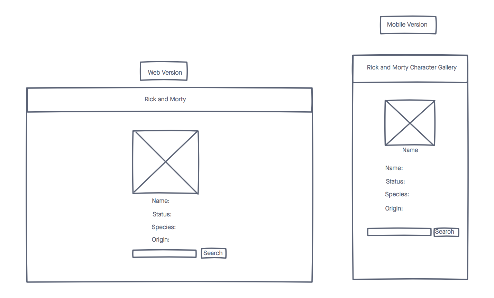

# Rick and Morty Character Search

A simple web app for visualizing Rick and Morty API data by name.

## Technologies
- HTML5
- CSS3
- JavaScript/jQuery
- [Rick and Morty API](https://rickandmortyapi.com/api/character)

## Screenshots

## Wireframes

### Images of Working App

## Getting Started

[Click here](https://cindyztran.github.io/rick-and-morty/) to see working app. 

## Future Enhancements
- allow user to be able to see versions of characters containing name e.g. "Evil Morty, Slick Morty, etc."